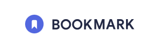
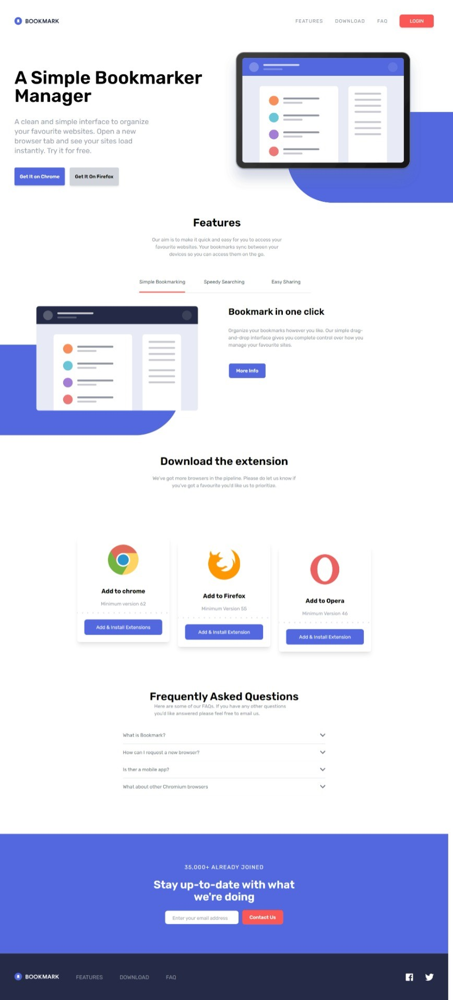
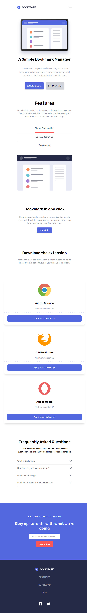
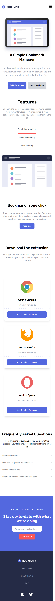
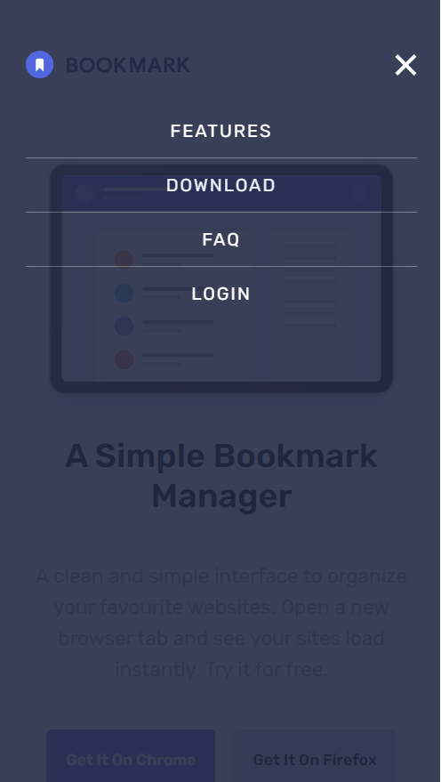

<br />
<p align="center">
  <a href="https://64fb2b49d0af9f007c6bc83b--frolicking-sprite-e31526.netlify.app/">
    
  </a>

<h3 align="center">Introducing the Bookmark Website: A Stylish Landing Page for Your Favorite Links!</h3>

<p align="center">
  Elevate Your Bookmarks with the Ultimate Landing Page Experience!
  <br />
  <br />
  <a href="https://64fb2b49d0af9f007c6bc83b--frolicking-sprite-e31526.netlify.app/">😊View Demo</a>


</p>
</p>


## Design Images

<div style="text-align:center;">
  <h3 >Desktop Design</h3>
  
</div>

<br />
<br />
<br />
<div style="text-align:center">
  <h3>Tablet Design</h3>

  
</div>
<br />
<br />
<br />
<div style="text-align:center">
  <h3>Mobile Design</h3>
  
</div>

<br />
<br />
<br />
<div style="text-align:center">
  <h3>Mobilemenu design</h3>

  
</div>


## Technologies Used

1. HTML5
2. CSS3
3. Tailwind Css
4. Javascirpt

## Frontend Mentor

This is practice project from Frontend mentor
<a href="https://www.frontendmentor.io/challenges/bookmark-landing-page-5d0b588a9edda32581d29158">LINK FOR FRONTEND
  MENTOR</a>

## Getting Started

### Prerequisites

There are some commands to used , to open this project in your local machine

* Installing node modules

```sh
npm install
```


### Watch Command

1. To make changes using Tailwind css , you have run this command
: It will makes changes to main stylesheets, here I'm using css/style.css

```sh
npm run watch
```